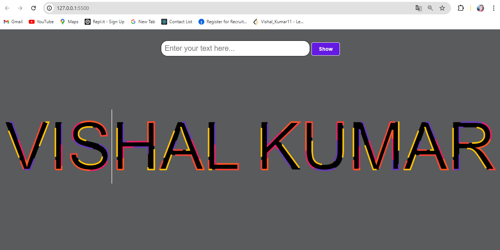

# Responsive SVG Text Animation

<p align="justify">This project demonstrates a responsive SVG text animation where you can input your name, and it will be displayed with a cool animation effect.</p>

## Features

- Responsive design
- SVG text animation
- Customizable name input
- Animated stroke effects

## Installation

1. Clone the repository:

    ```sh
    git clone https://github.com/your-username/responsive-svg-text-animation.git
    ```

2. Navigate to the project directory:

    ```sh
    cd responsive-svg-text-animation
    ```

3. Open the project in your preferred code editor.

## Usage

1. Open `index.html` in your web browser.
2. Enter your name in the input field.
3. Click the "Show" button or press "Enter" to display the animated text.

## File Structure

- ##### responsive-svg-text-animation/
    │
- ├── index.html
- ├── style.css
- └── script.js

### Files

- `index.html`: The main HTML file that contains the structure of the web page.
- `style.css`: The CSS file for styling the web page and SVG animation.
- `script.js`: The JavaScript file for handling user input and updating the SVG text.

## Customization

### HTML

Modify the `index.html` file to change the structure or content of the web page.

### CSS

Edit the `style.css` file to customize the styles, such as colors, font sizes, and animations.

### JavaScript

Update the `script.js` file to change the behavior of the text input and animation.

## License

This project is licensed under the MIT License. See the [LICENSE](LICENSE) file for details.


## Output Screen

- Screen

